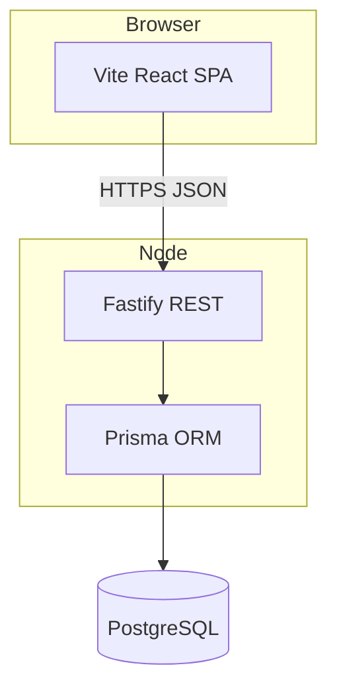

# Architecture Decision Document: Personal Todo App

## 1. Context

Single-user todo CRUD with React SPA and Node API. PostgreSQL for durability. Docker Compose for local and demo deployment.

## 2. High-level architecture

## 3. Key decisions

| Decision | Choice | Rationale |
|----------|--------|-----------|
| API style | REST JSON | Simple CRUD; easy to test with supertest |
| Runtime | Node 22 LTS | Aligns with Prisma + Fastify ecosystem |
| ORM | Prisma | Type-safe queries; migrations |
| DB | PostgreSQL | Matches Compose; room for multi-user later |
| IDs | UUID v4 | Safe client exposure; merge-friendly later |
| Validation | zod on API boundary | Shared shape with optional future shared package |

## 4. Component boundaries

- **`apps/web`:** pages/layout, `TodoList`, `TodoRow`, `AddTodoForm`, hooks for API client (`fetch` wrapper), global error/loading state.
- **`apps/api`:** Fastify server, route modules `todos`, `health`, Prisma client singleton, startup migration in Docker entrypoint.

## 5. Cross-cutting concerns

- **CORS:** Allow `WEB_ORIGIN` env (dev: `http://localhost:5173`, prod: `http://localhost:8080` for static nginx).
- **Errors:** JSON `{ "error": { "code", "message", "details?" } }` with appropriate HTTP status.
- **Logging:** `pino` pretty in dev; JSON in prod (optional minimal for v1).
- **Future auth:** todos table may add `userId` nullable or separate schema revision; API routes grouped for middleware later.

## 6. Deployment

- **docker-compose** profiles: `prod` builds images; `dev` optional for DB-only + local `pnpm dev`.
- **Migrations:** `prisma migrate deploy` before `node` start in API container.

## 7. API contract

Canonical detail: [`api-contract.md`](./api-contract.md) (this folder).

## 8. Testing strategy

- **Unit/component:** Vitest + RTL in `apps/web` for UI pieces; Vitest in `apps/api` for pure helpers if any.
- **Integration:** Vitest + `inject()` from Fastify against test DB or ephemeral Postgres (documented: use `DATABASE_URL` pointing at test DB).
- **E2E:** Playwright against running web + API (CI: start servers in globalSetup or use compose).

## 9. Risks

- **CORS misconfiguration** in Docker — document `WEB_ORIGIN` and `VITE_API_URL` clearly.
- **Migration drift** — API container must run migrate before listen.
